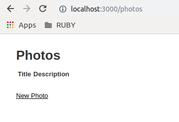
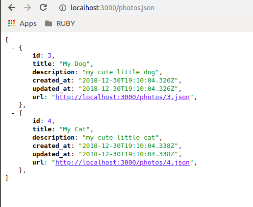
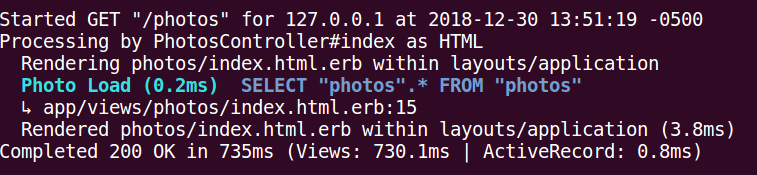
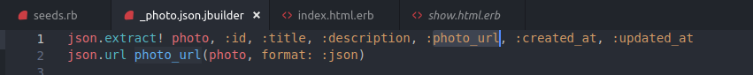
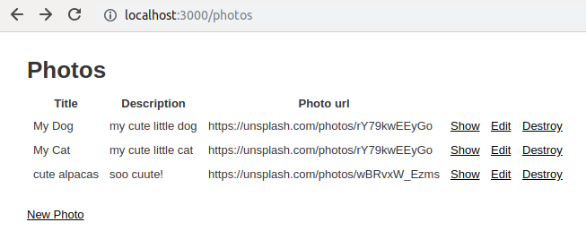
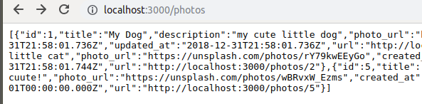

### Good quick start guide

https://codebrains.io/build-todolist-rest-api-ruby-rails/

### Rails command line

https://guides.rubyonrails.org/command_line.html


Common commands:
```
rails console
rails server            # starts server
bin/rails
rails generate
rails dbconsole
rails new app_name
```


##### `rails new app_name`

if dir (and git) exists,
`rails new . --git --database=postgresql` 


https://codeburst.io/how-to-build-a-good-api-using-rubyonrails-ef7eadfa3078

### Rails - API Mode

`rails new [api_name]  — api`

**Versioning**

`app/controllers/api/v1`

**Scaffolding a resource**

```
rails generate scaffold Article title:string content:text slug:string

rails dg:migrate
```

 A scaffold in Rails is a full set of model, database migration for that model, controller to manipulate it, views to view and manipulate the data, and a test suite for each of the above.


**Seeding the DB**

`seeds.rb`
`$ rails db:seed`


**Quick start with -API and Scaffold**

`$ rails server`



comes with some bootstrap and css too for the `/photos`


and raw json for `/photos.json`




very informative command line:




#### Modifying through migrations

https://stackoverflow.com/questions/6373202/how-does-one-add-an-attribute-to-a-model


Add a new column
```
$ rails generate migration AddNewColumnToMyTable column_name:column_type(string by default)

## edit ...rb

$ rails db:migrate
```

Add to `params`, check `photos_controller.rb` for this

```
    # Never trust parameters from the scary internet, only allow the white list through.
    def photo_params
      params.require(:photo).permit(:title, :description, :photo_url)
    end
```


when modifying params, also add it to the JSON Builder




**self.up vs change**
https://stackoverflow.com/questions/10365129/rails-migrations-self-up-and-self-down-versus-change


Rename a column - then do manually


#### Routes

By default, scaffold-generated routes default to a CRUD-like interface when doing
`/photos` for example




To default to a json output:
`routes.rb`

`resources :photos, defaults: {format: :json}`




**checking routes**

`rails routes`

#### A good API

A good api has 4 traits

predictable and consistent: code reuse for api end points.
static : an api should not change in a breaking way.
simple and clear: an api should return what’s expected.
flexible : easy to scale and maintain


#### Testing the API


#### CSRF

When POST requests are blocked due to CSRF:
https://stackoverflow.com/questions/35181340/rails-cant-verify-csrf-token-authenticity-when-making-a-post-request

request:
```
curl -X POST -H "Content-Type: application/json" -d '{"title": ouse", "description": "hahaha", "photo_url": "https://example.com"}' http://localhost:3000/photos
```

result:
```

Started POST "/photos" for 127.0.0.1 at 2019-01-01 16:10:34 -0500
   (0.6ms)  SELECT "schema_migrations"."version" FROM "schema_migrations" ORDER BY "schema_migrations"."version" ASC
  ↳ /var/lib/gems/2.3.0/gems/activerecord-5.2.2/lib/active_record/log_subscriber.rb:98
Processing by PhotosController#create as JSON
  Parameters: {"title"=>"My mouse", "description"=>"hahaha", "photo_url"=>"https://example.com", "photo"=>{"title"=>"My mouse", "description"=>"hahaha", "photo_url"=>"https://example.com"}}
Can't verify CSRF token authenticity.
Completed 422 Unprocessable Entity in 1ms (ActiveRecord: 1.7ms)
```

###### You can deactivate CSRF as pointed out by @dcestari:

```
class ApiController < ActionController::Base
  protect_from_forgery with: :null_session
end
```

Updated. In Rails 5 you can generate API only applications by using the --api option:

rails new appname --api
They do not include the CSRF middleware and many other components that are superflouus.